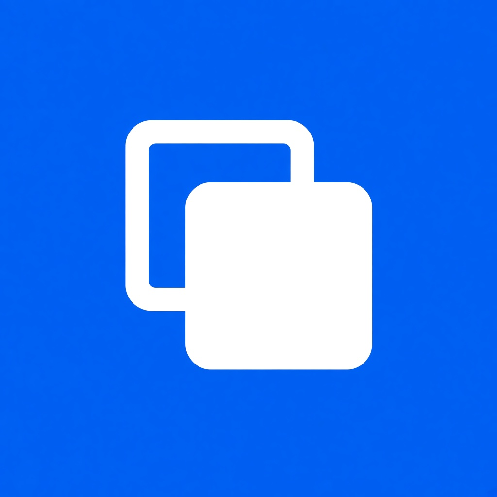
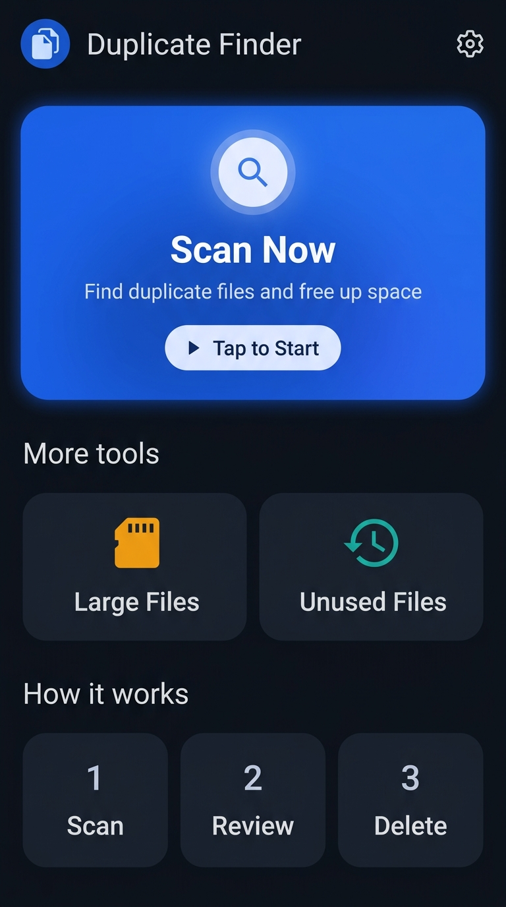
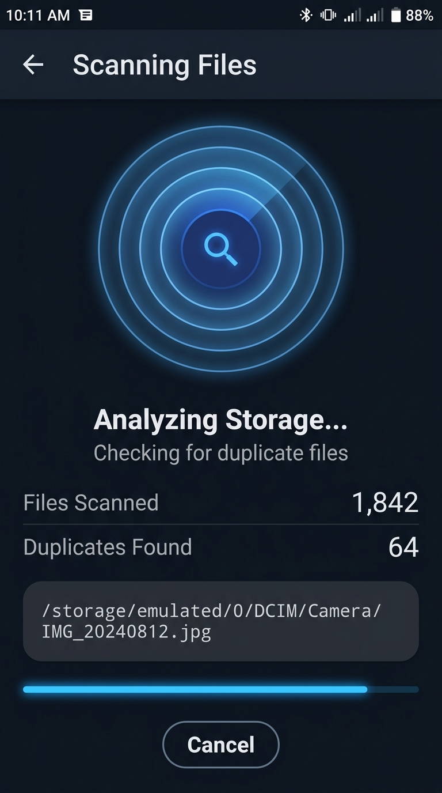
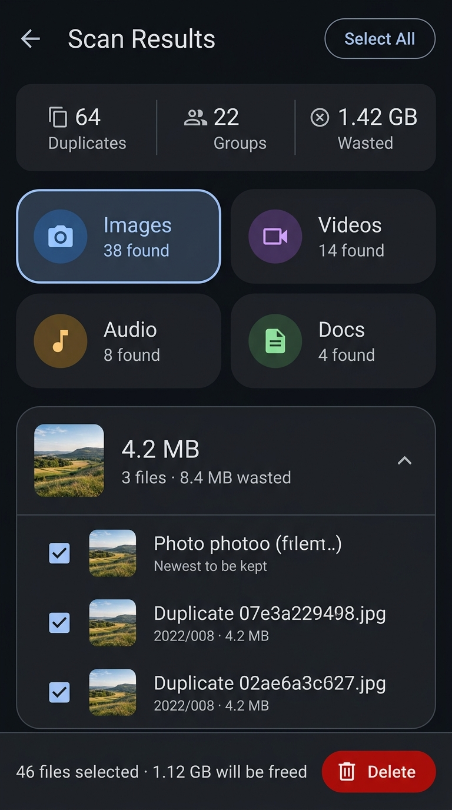
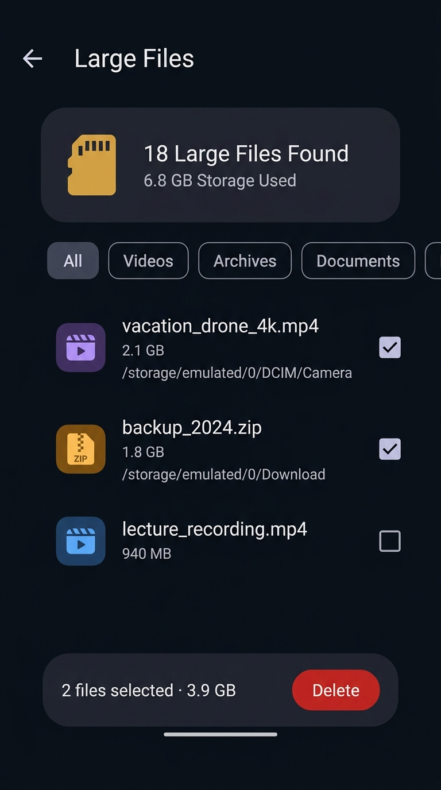

# Duplicate File Finder

<p align="center">
  
</p>

<p align="center">
  A modern, high-performance Flutter Android app that scans and detects duplicate files using chunked MD5 hash comparison, identifies large and unused files, and helps you reclaim valuable device storage.
</p>

<p align="center">
  
  
  
</p>

---

## 📱 Screenshots

| Dashboard | Scan in Progress | Scan Results | Large Files Cleaner |
| :---: | :---: | :---: | :---: |
|  |  |  |  |

---

## ✨ Features

- ⚡ **Lightning Fast Duplicate Scanning** — Pre-filters files by size first to eliminate unique sizes immediately, followed by memory-efficient chunked MD5 hashing.
- 📦 **Large Files Manager** — Locate the biggest files taking up your storage (4K videos, archives, disk images) and clean them in bulk.
- ⏳ **Unused Files Finder** — Discover old files and media that haven't been accessed or modified in months.
- 🗂️ **2x2 Category Filter Grid** — Instant filtering across **Images**, **Videos**, **Audio**, and **Documents** with dynamic counts and badges.
- 🎯 **Smart Auto-Selection** — Automatically preserves the original/newest file while pre-selecting extra duplicates for one-tap deletion.
- 🖼️ **In-App Media Player & Previews** — Built-in viewers for images, videos (`video_player`), and audio tracks (`just_audio`) before taking any destructive action.
- 🔍 **File Inspection** — Deep details including absolute path, file size, last modified timestamp, and exact MD5 checksum.
- 🛡️ **Safe & Confirmed Deletion** — Safeguard confirmation modal showing the exact number of files and freed storage space before deletion.
- 🌙 **Modern Dark Theme** — Sleek dark UI with vibrant blue accents, smooth card animations, and responsive layout.

---

## 🛠️ Tech Stack

| Package | Purpose |
|---|---|
| `crypto` | Chunked MD5 file hashing engine |
| `permission_handler` | Android storage & All-Files-Access (`MANAGE_EXTERNAL_STORAGE`) |
| `shared_preferences` | Persistent scan preferences and thresholds |
| `video_player` | Native in-app video playback |
| `just_audio` | In-app audio player for previewing duplicate sound files |
| `open_file` | Opening files in external system viewers |
| `intl` | Timestamp and date formatting |
| `path` | Cross-platform file path resolution and utilities |

---

## 📁 Project Structure

```
lib/
├── main.dart
├── models/
│   ├── duplicate_file.dart          # DuplicateFile & DuplicateGroup models
│   ├── file_types.dart              # Supported file extension categories
│   └── scan_mode.dart               # Scan modes (duplicates, large files, unused files)
├── services/
│   ├── app_settings.dart            # SharedPreferences configuration service
│   └── file_scanner_service.dart    # High-performance scanning & MD5 hashing engine
├── screens/
│   ├── home_screen.dart             # Main dashboard & mode selector
│   ├── scanning_screen.dart         # Real-time scan progress & live path indicator
│   ├── results_screen.dart          # Grouped duplicates review & batch delete
│   ├── file_list_screen.dart        # Large files and unused files management
│   ├── file_detail_screen.dart      # File metadata, preview, and MD5 inspector
│   ├── media_player_screen.dart     # Dedicated in-app media player
│   └── settings_screen.dart         # Configurable scan criteria and thresholds
├── utils/
└── widgets/
    └── duplicate_group_card.dart    # Expandable duplicate group card with thumbnails
```

---

## 🚀 Getting Started

### Prerequisites

- Flutter SDK (version `^3.11.5` or higher)
- Android SDK / Android Studio (Targeting Android 11+ / API 30+)

### Installation & Run

```bash
# Clone repository
git clone https://github.com/your-username/duplicate_file_finder.git
cd duplicate_file_finder

# Install dependencies
flutter pub get

# Run on connected Android device / emulator
flutter run
```

---

## 🔒 Permissions (Android)

This application requires **All files access** (`MANAGE_EXTERNAL_STORAGE`) because it scans and cleans duplicate documents, archives, and system files across shared storage, which cannot be accessed via standard media store permissions alone.

| Android Version | Permission Required | Description |
|---|---|---|
| **Android 11+ (API 30+)** | `MANAGE_EXTERNAL_STORAGE` | Full shared storage access to scan all file types |
| **Android 10 (API 29)** | `READ_EXTERNAL_STORAGE` + `requestLegacyExternalStorage` | Legacy external storage read/write |
| **Android 9 & below** | `READ_EXTERNAL_STORAGE` / `WRITE_EXTERNAL_STORAGE` | Standard storage permissions |

---

## ⚙️ How It Works

1. **Select Mode**: Choose between **Scan Duplicates**, **Large Files**, or **Unused Files**.
2. **Size Grouping**: The scanner indexes storage (`/storage/emulated/0`), ignoring system caches (`Android/data`, `Android/obb`), and groups files matching identical byte sizes.
3. **MD5 Hashing**: Only candidate files with matching byte sizes undergo chunked MD5 checksum calculation, maximizing scan speed and saving CPU/battery.
4. **Review & Batch Select**: Files with identical hashes are grouped together. The newest original copy is protected, and duplicate copies are selected.
5. **Delete & Reclaim**: Review thumbnails, play media previews, and safely delete duplicates with real-time freed storage feedback.

---

## 📦 Build APK

To build a release APK for Android:

```bash
flutter build apk --release
```

The compiled release APK will be located at:
```
build/app/outputs/flutter-apk/app-release.apk
```

---

## 📄 License

This project is licensed under the MIT License - see the LICENSE file for details.
